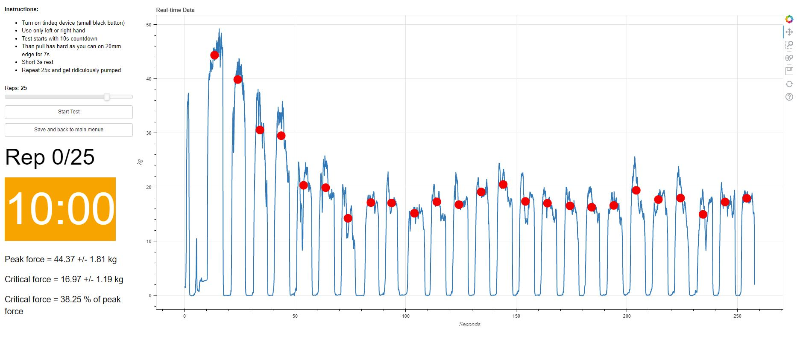

# Tindeq-Progressor-climbing-strength-test-server
A python and bokeh application that creates a user interface to run climbing strength tests, that can store, visualize and send results 

Designed for a self-assessment test station in our local climbing gym with this device: https://tindeq.com/product/progressor/

Here is an example for the critical force test, that comes with a built in timer and countdown sounds:


The code is partially based on this repository: https://github.com/StuartLittlefair/PyTindeq

run as bokeh server (current password is 'pw', can be changed in code):

```python
bokeh serve tindeq_assessment --show
```

or standalone version (no password required):
```python
python tindeq_assessment/standalone.py
```
Compiled .exe can be downloaded under 'releases'

When entering bodyweight, the test results are interpredted as follows:
```
Results:

Max. strength left: 88.07 % BW
Max. strength right: 85.55 % BW
Peak force: 68.49 % BW
Critical force: 45.75 % BW
Critical force: 66.81 % of peak force
RFD left: 163.81 % kg/s
RFD right: 160.46 % kg/s

Predicted redpoint grades (french sport):

If one predictor is far below the others, you might improve by focusing training here
If predictions are far below your real redpoint level, you might improve by focusing on techniqe and mental traning
Max. strength: 7a+ - 7c+
Endurance: 7a - 7c+
Contact strength: 7b - 7c
```
This is based on linar regression from these papers:
https://www.researchgate.net/publication/343601001_An_All-Out_Test_to_Determine_Finger_Flexor_Critical_Force_in_Rock_Climbers

https://www.researchgate.net/publication/361584427_Differences_in_Upper-Body_Peak_Force_and_Rate_of_Force_Development_in_Male_Intermediate_Advanced_and_Elite_Sport_Climbers


The software also provides a training mode, where you can set reps, duration rest time and target force zones


